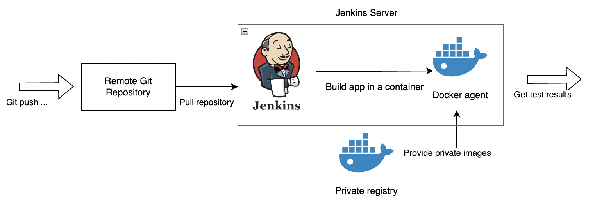

# Jenkins CI Pipeline

## Objective

Build a CI testing environment to automatically running the build, testing actions whenever the code in remote repository changes.

## CI Pipeline



## Setup

1. In terminal, to run `docker-compose up -d`, to setup Jenkins, private registry

2. Push any images depends on the project to the private registry running at `localhost:5001`, e.g.,

    ```shell
    docker push localhost:5001/my-ubuntu
    ```

3. Browse to `http://localhost:8080`, setting up the Jenkins project.

    When you first access a new Jenkins instance, you need to finish the initial setup, such as unlocking Jenkins, \
    installation of plugins, creating the first administrator user, and add a new global credential for docker agent. \
    Or you can run the command `docker exec <jenkins-container-name> bash -c "/var/jenkins_home/post_installation.sh"` \
    to automatically setup jenkins and configure the docker agent of Jenkins.

    **Add a new global credential for docker agent**

    1. From the Jenkins home page, click **Manage Jenkins > Manage Credentials**.

    2. Under **Stores scoped to Jenkins** on the right, click on **Jenkins**.

    3. Under **System**, click the **Global credentials (unrestricted)** link to access this default domain.

    4. Click **Add Credentials** on the left.

    5. From the **Kind** field, choose the **X.509 Client Certificate** to add.

    6. From the Scope field, choose **Global**.

    7. Copy and paste the appropriate details into the Client Key, Client Certificate and Server CA Certificate fields.

        Client Key, obtain by running `docker exec <dind-container-name> cat /certs/client/key.pem`

        Client Certificate, obtain by running `docker exec <dind-container-name> cat /certs/client/cert.pem`

        Server CA Certificate, obtain by running `docker exec <dind-container-name> cat /certs/server/ca.pem`

    8. In the ID field, specify a meaningful credential ID value.

    9. Click OK to save the credential.

    10. After creating your credential, click **Manage Jenkins > Manage nodes and clouds > Configure Clouds > Docker Cloud details**. \
    From the Server credentials, choose the id of the credential you created previously and click the Test Connection button and \
    you should see the information of the docker daemon.

## Git Hooks

In Jenkins, we can use webhooks to have GitHub notify Jenkins whenever the code in GitHub changes. \
Jenkins can respond by automatically running the build to implement any changes.

Configuring webhooks in Jenkins. We neet to:

- Create an access token in GitHub that has permission to read and create webhooks

- Add a GitHub server in Jenkins for GitHub.com

- Create a Jenkins credential with the token and configure the GitHub server configuration to use it

- Check "Manage Hooks" for the GitHub server configuration

- In the project configuration, under "Build Triggers" select "GitHub hook trigger for GITScm polling"
